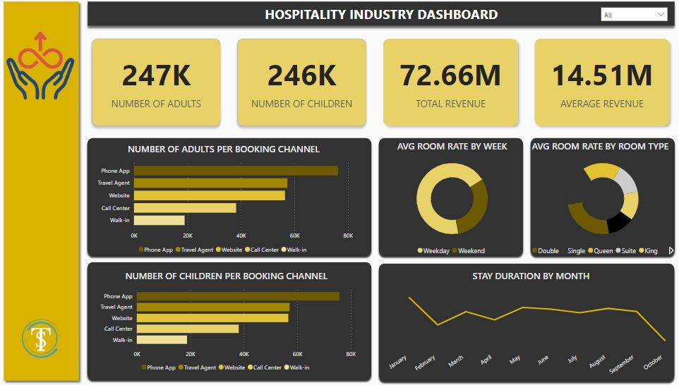

# DATA ANALYTICS PORTFOLIO 

**Thank you for taking the time to review my portfolio. These projects showcase my analytical skills across Excel, SQL, and Power BI, demonstrating my ability to extract insights and drive data-driven decisions.**

# EXCEL PROJECT

## Project 1

**Project Overview**

**Title:** [Retail Sales Data](https://github.com/Dennistheanalyst/dennistheanalyst.github.io/blob/main/retail_sales_data%20Excel.xlsx)

**Tools Used:** Microsoft Excel (Power Query for data cleaning, Coditional Formating, Pivot Tables, Slicers, use of slicers, Pivot Charts, Timeline, shapes, Shape format)

**Project Description:** This project involved analysing sales data of a company to identify trends and patterns in sales performance for 2015 and 2016. It is designed to provide a comprehensive overview of key performance metrics. This dashboard allows stakeholders to easily monitor and analyze the company’s performance across different regions, states, and time periods. The dashboard includes the following features:

KPIs : 

- **Total Revenue :** Total revenue generated by the company.
- **Total Profit :** Total Profit made by the Company.
- **Total Cost :** Sum of all expenses accrued by the company.
- **Total Quantity :** Total number of goods produced by t he company.
- **Profit/Revenue by Country:** Visual representation of profits and revenue broken down by each country.
- **Total Units Sold per Month:** A monthly breakdown of the total units sold, providing insights into sales trends over time.
- **Profit/Revenue by Month:** Displays the monthly profit and revenue, allowing for easy comparison of profitability throughout the year.
- **Total Revenue by Country and by various states:** Highlights the total revenue generated in each country and states, showcasing the performance in different markets.

Additionally, the dashboard includes interactive slicers and timeline for:
- **Month:** Filter the data to view performance for a specific month or range of months.
- **Country:** Focus on specific countries to analyze regional performance.
- **Gender:** Drill down into the performance of each gender.

## Project Objectives
1. **Data Cleaning** - Identify and handle missing or null values to ensure data accuracy and reliability.
2. **Exploratory Data Analysis** - Utilization of pivot tables for exploratory data analysis
3. **Insights and analysis** - Leveraging Excel Dashboard Design for Data Analysis  and to provide key patterns, trends, and relationships within the dataset


## Project Structure:

### Data Cleaning

- **Remove blanks and Null values**: Identify Null values in data and make sure that there values are cleared.
- **Null Value Check**: Check for any null values in the dataset and delete records with missing data.
- **Remove duplicates**: Remove duplicates value to avoid inflation of figure and t maintain data accuracy.
- **Standardize Data Formatting**: Remove extra spaces using the TRIM function to ensure consistency, Retrieve data from related sources using functions like XLOOKUP and INDEX MATCH for efficient data mapping, Refine data categorization with the IF statement to standardize values within a specific column.
- **Convert Data into Tables for Easy Analysis**

## Data Analysis
- **Utilization of pivot tables for data analysis and Identify KPIs 


### 3. Findings
- **Seasonal Trends** - Identified sales and profit trends that align with seasonal events and market cycles, providing valuable insights for strategic business planning. These findings help optimize inventory management, promotional campaigns, and resource allocation to maximize profitability during peak seasons and mitigate downturns during slower periods.
- **Top performing Countries** - Germany leads as the top-performing country in sales with 42%, followed by the United States at 31%, the UK at 15%, and France at 12%. To maintain strong sales in top-performing regions, strategies such as personalized promotions, loyalty programs, and optimizing the supply chain should be prioritized. For regions with lower performance, like France, focusing on targeted marketing, boosting customer engagement, and expanding distribution channels will be essential to drive sales growth.
- **Sales Volatility** - Conducted an in-depth analysis of monthly sales fluctuations to identify seasonal trends, demand patterns, and potential market shifts. These insights enable data-driven decision-making, allowing the business to optimize inventory management, refine marketing strategies, and adjust sales tactics to align with changing consumer behaviors and market conditions.
- **Regional Profitability** - identify performing regions and underperforming regions and suggest strategies to increase profitability in theses regions
- **Customer Demographics** - This project analyzes customer performance based on key attributes such as age and gender, and identifies the products preferred by customers based on these demographic factors.


## Reports
- The analysis reveals that the United States leads in sales, with California being the top-performing state, followed by England during this period. Therefore, if stakeholders allocate resources for targeted marketing campaigns in these regions, there is potential for a 12% increase in sales within the next 3 months.
- There is a strong need to focus on retaining existing customers in the leading countries rather than seeking new ones. This approach will help reduce costs while driving higher sales and fostering long-term customer loyalty.
- Sales in underperforming regions could increase by 10% with the implementation of strategies focused on enhancing customer service. Additionally, management should prioritize reducing operational costs in these regions to improve overall profitability and efficiency.
- The leading product favored across these four countries is Mountain Bikes. Given the data indicating a growing demand for this product, it is essential to ensure a consistent supply of Mountain Bikes in all these regions to meet customer needs and capitalize on the rising demand.
- The analysis highlights that May, June, and December are the peak periods when sales for all products are maximized. Therefore, it is crucial to make adequate preparations ahead of these peak periods to meet customer demand and fully capitalize on sales opportunities.


## Conclusion
This project offers a comprehensive guide to advanced Excel techniques for data analysts in the retail sales industry. It covers data cleaning, exploratory data analysis with pivot tables, and visualizing insights through interactive dashboards. The objective is to help retail companies enhance sales performance and refine strategies based on monthly trends and data-driven analysis.


**Dashboard Overview:** 


# SQL PROJECT

## Project 1

**Project Overview**

[reatail_sales_sql_dataset](https://github.com/Dennistheanalyst/dennistheanalyst.github.io/blob/main/Retail_sales_sql_Dataset.xlsx)

**Title:** Optimizing Retail Sales Insights: A SQL Data Analysis Project

This project showcases essential SQL skills and techniques commonly used by data analysts to explore, clean, and analyze retail sales data. It involves creating a retail sales database, conducting exploratory data analysis (EDA), and using SQL queries to answer key business questions. Designed for beginners in data analysis, this project helps build a strong foundation in SQL while providing hands-on experience with real-world data.

## Project Objectives
1. **Retail Sales Database Setup** – Create and populate a structured retail sales database using the provided dataset.
2. **Data Cleaning** – Identify and handle missing or null values to ensure data accuracy and reliability.
3. **Exploratory Data Analysis (EDA)** – Conduct basic analysis to understand key patterns, trends, and relationships within the dataset.
4. **Business Insights & Analysis** – Utilize SQL queries to address specific business questions, extract meaningful insights, and support data-driven decision-making.

## Project Structure:

### 2. Data Exploration & Cleaning

- **Record Count**: Determine the total number of records in the dataset.
- **Customer Count**: Find out how many unique customers are in the dataset.
- **Category Count**: Identify all unique product categories in the dataset.
- **Null Value Check**: Check for any null values in the dataset and delete records with missing data.

```sql
SELECT *
FROM [dbo].[Retail_sales]
WHERE [transactions_id] IS NULL

SELECT *
FROM [dbo].[Retail_sales]
WHERE [transactions_id] IS NULL
OR
[sale_date] IS NULL
OR
[sale_time] IS NULL
OR
[customer_id] IS NULL
OR
[gender] IS NULL
OR
[category] IS NULL
OR
[quantiy] IS NULL
OR
[price_per_unit] IS NULL
OR
[cogs] IS NULL
OR
[total_sale] IS NULL;

DELETE FROM [dbo].[Retail_sales]
WHERE [transactions_id] IS NULL
OR
[sale_date] IS NULL
OR
[sale_time] IS NULL
OR
[customer_id] IS NULL
OR
[gender] IS NULL
OR
[category] IS NULL
OR
[quantiy] IS NULL
OR
[price_per_unit] IS NULL
OR
[cogs] IS NULL
OR
[total_sale] IS NULL;

SELECT *
FROM [dbo].[Retail_sales]

SELECT COUNT(*)
FROM [dbo].[Retail_sales]
```

### DATA ANALYSIS AND FINDINGS:

**SQL Code:** 
1. **Write a SQL query to retrieve all columns for sales made on '2022-11-05**:

```sql
SELECT *
FROM [dbo].[Retail_sales]
WHERE  [sale_date] = '2022-11-05';
```

2. **Write a SQL query to retrieve all transactions where the category is 'Clothing' and the quantity sold is more than 4 in the month of Nov-2022**:

```sql
SELECT *
FROM [dbo].[Retail_sales]
WHERE [category] = 'Clothing'
AND 
[quantiy] >= 4
AND
YEAR([sale_date]) = '2022'
AND 
MONTH([sale_date]) = '11';
```

3. **Write a SQL query to calculate the total sales (total_sale) for each category.**:

```sql
SELECT [category], SUM([total_sale])
FROM [dbo].[Retail_sales]
GROUP BY [category]
```

4. **Write a SQL query to find the average age of customers who purchased items from the 'Beauty' category.**:

```sql
SELECT ROUND(AVG([age]),2) AS Avg_age
FROM [dbo].[Retail_sales]
WHERE [category] = 'Beauty';
```

5. **Write a SQL query to find all transactions where the total_sale is greater than 1000.**:

```sql
SELECT *
FROM [dbo].[Retail_sales]
WHERE [total_sale]>1000;
```

6. **Write a SQL query to find the total number of transactions (transaction_id) made by each gender in each category.**:

```sql
SELECT [gender],[category], COUNT([transactions_id]) AS [transactions_id]
FROM [dbo].[Retail_sales]
GROUP BY [gender],[category]
ORDER BY [category]
```

7. **Write a SQL query to calculate the average sale for each month. Find out best selling month in each year**:

```sql
WITH monthlysales AS 
(
SELECT 
		YEAR([sale_date]) AS Year,
		MONTH([sale_date]) AS Month, 
		AVG([total_sale]) AS avg_sales,
		SUM([total_sale]) AS total_sales,
		RANK() OVER(PARTITION BY YEAR([sale_date]) ORDER BY AVG([total_sale]) DESC) AS Rank
		FROM [dbo].[Retail_sales]
		GROUP BY YEAR([sale_date]),MONTH([sale_date])
	)

SELECT  Year,
Month,
avg_sales
FROM monthlysales
WHERE Rank = 1;
```

8. **Write a SQL query to find the top 5 customers based on the highest total sales **:

```sql
SELECT TOP 5 [customer_id], SUM([total_sale]) AS Total_sales
	FROM [dbo].[Retail_sales]
	GROUP BY [customer_id]
	ORDER BY Total_sales DESC;
```

9. **Write a SQL query to find the number of unique customers who purchased items from each category.**:

```sql
SELECT  COUNT(DISTINCT [customer_id]) AS Customers, [category]
FROM [dbo].[Retail_sales]
GROUP BY [category];
```

10. **Write a SQL query to create each shift and number of orders (Example Morning <12, Afternoon Between 12 & 17, Evening >17)**:

```sql
WITH hourly_sales AS (
SELECT *,
CASE 
	 WHEN DATEPART(HOUR, [sale_time]) <= 12 THEN 'Morning'
	 WHEN DATEPART(HOUR, [sale_time]) BETWEEN 12 AND 17 THEN 'AFTERNOON'
	 ELSE 'Evening' END AS Shift
FROM [dbo].[Retail_sales]
)
SELECT 
Shift,
COUNT([transactions_id]) AS total_orders
FROM hourly_sales
GROUP BY Shift;
```


### 3. Findings

- **Customer Demographics** – The dataset features customers from diverse age groups, with purchases spanning various categories like Clothing and Beauty.
- **High-Value Transactions** – A significant number of transactions exceed $1,000, highlighting premium purchases.
- **Sales Trends** – Monthly sales analysis reveals fluctuations in demand, helping pinpoint peak seasons.
- **Customer Insights** – Identifies top-spending customers and the most popular product categories, providing valuable business intelligence.

## Reports

- **Sales Summary:** A detailed report summarizing total sales, customer demographics, and category performance.
- **Trend Analysis:** Insights into sales trends across different months and shifts.
- **Customer Insights:** Reports on top customers and unique customer counts per category.

## Conclusion

This project offers a thorough introduction to SQL for aspiring data analysts, covering key areas such as database setup, data cleaning, exploratory data analysis (EDA), and business-focused SQL queries. The insights gained from this project provide valuable information on sales trends, customer behavior, and product performance, which can support informed business decision-making.

**Technology Used:** SQL server


## Project 2

[JOINS](https://github.com/Dennistheanalyst/dennistheanalyst.github.io/blob/main/JOINS.xlsx)

**Title:** Interrogating data(JOINS)

**Project Description:** This project analyzes company data to extract key information based on management's requests. It utilizes the JOIN statement to combine multiple tables to provide report for management based on companys request. 
Additionally, clauses such as WHERE, BETWEEN, IN, and WHEN are used to filter the data that are specifically requested by the company.

## Project Objectives

- Extract specific customer and salesperson details based on location.
- Retrieve information by joining multiple tables like salesman, customer, and orders.
- Retrieve information by joining multiple tables (salesman, customer, orders)
- Generate reports on orders, salespersons, and commissions.
- Generate Cartesian products to analyze all possible salesperson-customer pairings.


## Project Structure:

###  Data Cleaning
- Removing Null Vallues
- Replacinin a null value with a figure(100)

```sql
SELECT *
FROM [dbo].[Orders]
WHERE [Order Number] IS NULL;

DELETE [dbo].[Orders]
WHERE [Order Number] IS NULL;

UPDATE [dbo].[Customers]
SET [Grade] = 100
WHERE [Grade] IS NULL;
```

### DATA ANALYSIS:

**SQL Code:** 

- **write a SQL query to find those orders where the order amount exists between 500 and 2000. Return ord_no, purch_amt, cust_name, city.**
```sql
  SELECT O.[Order Number],O.[Purchase_Amount],C.[Customer_Name],[City]
FROM [dbo].[Orders] O
JOIN [dbo].[Customers] C
	ON O.[Customer ID] = C.[Customer_ID]
WHERE [Purchase_Amount] BETWEEN 500 AND 2000
```
- **Write a SQL statement to join the tables salesman, customer and orders so that the same column of each table appears once and only the relational rows are returned.** 
```sql
SELECT *
FROM [dbo].[Salesmans] S
JOIN [dbo].[Customers] C
	ON S.[Salesman_id] = C.[Salesman_ID]
JOIN [dbo].[Orders] O
	ON O.[Salesman_id] = S.[Salesman_id]
```
- **Write a SQL statement to generate a report with the customer name, city, order no. order date, purchase amount for only those customers on the list who must have a grade and placed one or more orders or which order(s) have been placed by the customer who neither is on the list nor has a grade.**
```sql
SELECT C.[Customer_Name],C.[City],O.[Order Number],O.[Order Date],O.[Purchase_Amount]
 FROM [dbo].[Customers] C
 LEFT JOIN [dbo].[Orders] O
	ON C.[Customer_ID] = O.[Customer ID]
	WHERE ([Customer_ID] IS NOT NULL
	AND [Grade] IS NOT NULL)
	OR (C.[Customer_ID] IS NOT NULL
	OR C.[Grade] IS NOT NULL)
```
- **Write a SQL statement to create a Cartesian product between salesperson and customer, i.e. each salesperson will appear for every customer and vice versa for those salesmen who belong to a city and customers who require a grade.**
```sql
SELECT *
FROM [dbo].[Salesmans] S
JOIN [dbo].[Customers] C
ON S.[city] = C.[City]
WHERE C.[Grade] IS NOT NULL;
```

## Conclusion 
Based on managements request I was able to fetch these information for their consumption using JOINS.

# POWER BI PROJECT

## Project 1

**Title:** [Hospitality Industry Dashboard](https://github.com/Dennistheanalyst/dennistheanalyst.github.io/blob/main/Hospitality%20industry%20project.pbix)

**Tools Used:** Power BI, Power Query, DAX functions, Charts, Shapes, Slicers.

**Project Description:** This project analyzed data from the hospitality sector to uncover trends and patterns in sales performance, guest stay durations by month, and the most popular booking channels. Additionally, it examined the demographic profile of visitors, including the count of children and adults throughout the year. The analysis also explored the average rates of different room types and the average rates by week.
It provides a detailed overview of essential performance metrics, enabling stakeholders to effectively track and assess the company’s performance across various metrics. The dashboard offers the following functionalities:

Number of Adults: The total count of adults who stayed at the hotel over the course of the year.

Number of Children: The total number of children who stayed at the hotel during the year.

Total Revenue: The overall revenue earned throughout the year.

Average Revenue: The yearly average revenue generated.

Number of Adults per booking Channel: Number of adults that uses various booking channels to book the hotel.

Number of Children Per Booking Channel: Number of Children that uses various booking channels to book the hotel.

Average Room Rate by week: Average price of the room by week be it weekend or weekday.

Average room rate by room type: The average rates of different room types offered at these hotels.

Stay Duration by month: This considers the length of time hotel patrons stay throughout the year.

Additionally, the dashboard includes interactive slicers and timeline for:

Months:  Filter the data to view performance for a specific month or range of months.

**Key findings:** Channel Optimization: Identifies key channels the company should prioritize to enhance customer service and improve performance across other booking channels.

Seasonal Patterns: Analyzes the months when customers tend to stay longer at the hotels, enabling the company to optimize profitability and deliver exceptional customer service.

Sales Volatility: Analyzed monthly sales fluctuations to understand market dynamics and adjust business strategies accordingly.

**Dashboard Overview:** 


