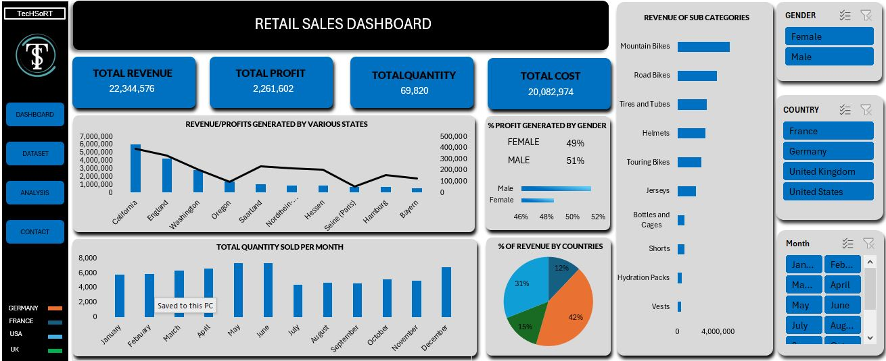

# DATA ANALYTICS PORTFOLIO 

**Thank you for taking the time to review my portfolio. These projects showcase my analytical skills across Excel, SQL, and Power BI, demonstrating my ability to extract insights and drive data-driven decisions.**

# EXCEL PROJECTS

## Project 1

**Project Overview**

**Title:** [Retail Sales Data](https://github.com/Dennistheanalyst/dennistheanalyst.github.io/blob/main/retail_sales_data%20Excel.xlsx)

**Tools Used:** Microsoft Excel (Power Query for data cleaning, Coditional Formating, Pivot Tables, Slicers, use of slicers, Pivot Charts, Timeline, shapes, Shape format)

**Project Description:** This project involved analysing sales data of a company to identify trends and patterns in sales performance for 2015 and 2016. It is designed to provide a comprehensive overview of key performance metrics. This dashboard allows stakeholders to easily monitor and analyze the company’s performance across different regions, states, and time periods. The dashboard includes the following features:

KPIs : 

- **Total Revenue :** Total revenue generated by the company.
- **Total Profit :** Total Profit made by the Company.
- **Total Cost :** Sum of all expenses accrued by the company.
- **Total Quantity :** Total number of goods produced by t he company.
- **Profit/Revenue by Country:** Visual representation of profits and revenue broken down by each country.
- **Total Units Sold per Month:** A monthly breakdown of the total units sold, providing insights into sales trends over time.
- **Profit/Revenue by Month:** Displays the monthly profit and revenue, allowing for easy comparison of profitability throughout the year.
- **Total Revenue by Country and by various states:** Highlights the total revenue generated in each country and states, showcasing the performance in different markets.

Additionally, the dashboard includes interactive slicers and timeline for:
- **Month:** Filter the data to view performance for a specific month or range of months.
- **Country:** Focus on specific countries to analyze regional performance.
- **Gender:** Drill down into the performance of each gender.

## Project Objectives
1. **Data Cleaning** - Identify and handle missing or null values to ensure data accuracy and reliability.
2. **Exploratory Data Analysis** - Utilization of pivot tables for exploratory data analysis
3. **Insights and analysis** - Leveraging Excel Dashboard Design for Data Analysis  and to provide key patterns, trends, and relationships within the dataset

## Project Structure:

### Data Cleaning

- **Remove blanks and Null values**: Identify Null values in data and make sure that there values are cleared.
- **Null Value Check**: Check for any null values in the dataset and delete records with missing data.
- **Remove duplicates**: Remove duplicates value to avoid inflation of figure and t maintain data accuracy.
- **Standardize Data Formatting**: Remove extra spaces using the TRIM function to ensure consistency, Retrieve data from related sources using functions like XLOOKUP and INDEX MATCH for efficient data mapping, Refine data categorization with the IF statement to standardize values within a specific column.
- **Convert Data into Tables for Easy Analysis**

## Data Analysis
- **Utilization of pivot tables for data analysis and Identify KPIs 

### 3. Findings
- **Seasonal Trends** - Identified sales and profit trends that align with seasonal events and market cycles, providing valuable insights for strategic business planning. These findings help optimize inventory management, promotional campaigns, and resource allocation to maximize profitability during peak seasons and mitigate downturns during slower periods.
- **Top performing Countries** - Germany leads as the top-performing country in sales with 42%, followed by the United States at 31%, the UK at 15%, and France at 12%. To maintain strong sales in top-performing regions, strategies such as personalized promotions, loyalty programs, and optimizing the supply chain should be prioritized. For regions with lower performance, like France, focusing on targeted marketing, boosting customer engagement, and expanding distribution channels will be essential to drive sales growth.
- **Sales Volatility** - Conducted an in-depth analysis of monthly sales fluctuations to identify seasonal trends, demand patterns, and potential market shifts. These insights enable data-driven decision-making, allowing the business to optimize inventory management, refine marketing strategies, and adjust sales tactics to align with changing consumer behaviors and market conditions.
- **Regional Profitability** - identify performing regions and underperforming regions and suggest strategies to increase profitability in theses regions
- **Customer Demographics** - This project analyzes customer performance based on key attributes such as age and gender, and identifies the products preferred by customers based on these demographic factors.

## Reports
- The analysis reveals that the United States leads in sales, with California being the top-performing state, followed by England during this period. Therefore, if stakeholders allocate resources for targeted marketing campaigns in these regions, there is potential for a 12% increase in sales within the next 3 months.
- There is a strong need to focus on retaining existing customers in the leading countries rather than seeking new ones. This approach will help reduce costs while driving higher sales and fostering long-term customer loyalty.
- Sales in underperforming regions could increase by 10% with the implementation of strategies focused on enhancing customer service. Additionally, management should prioritize reducing operational costs in these regions to improve overall profitability and efficiency.
- The leading product favored across these four countries is Mountain Bikes. Given the data indicating a growing demand for this product, it is essential to ensure a consistent supply of Mountain Bikes in all these regions to meet customer needs and capitalize on the rising demand.
- The analysis highlights that May, June, and December are the peak periods when sales for all products are maximized. Therefore, it is crucial to make adequate preparations ahead of these peak periods to meet customer demand and fully capitalize on sales opportunities.

## Conclusion
This project offers a comprehensive guide to advanced Excel techniques for data analysts in the retail sales industry. It covers data cleaning, exploratory data analysis with pivot tables, and visualizing insights through interactive dashboards. The objective is to help retail companies enhance sales performance and refine strategies based on monthly trends and data-driven analysis.

**Dashboard Overview:** 

